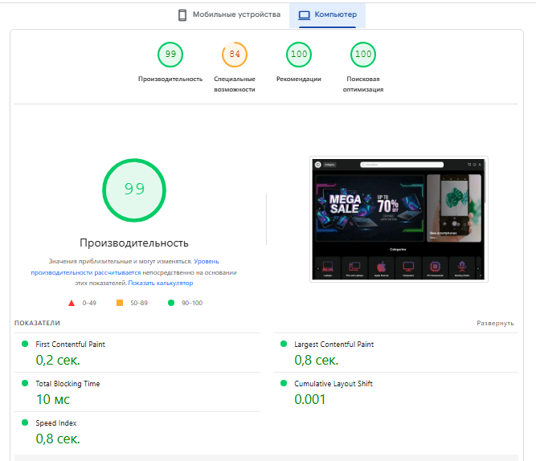
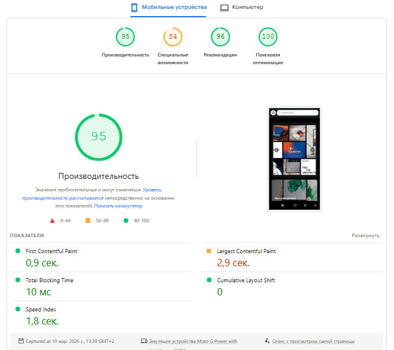

# 🛒 Electronics E-commerce Platform

Live Demo: [View Demo](https://next-magazin-electroniki-i9b2.vercel.app/)  
A scalable full-stack electronics marketplace built with **Next.js** and **TypeScript**.

The platform supports dynamic product variations, category-specific specifications, advanced filtering, authentication, and order management.  
Both frontend and backend are implemented inside the Next.js application using API routes and Prisma ORM.

---

## 📸 Project Preview


---

## 🚀 Tech Stack

**Frontend**

- Next.js (App Router)
- React
- TypeScript
- Tailwind CSS
- shadcn/ui
- React Query
- Zustand
- Axios

**Backend**

- Next.js API routes
- Prisma ORM
- PostgreSQL / MySQL (depends on env)
- NextAuth authentication

---

## ✨ Key Features

- Dynamic product system with flexible specifications per category
- Product variations (color, memory, etc.)
- Advanced filtering & sorting
- Server state caching & synchronization via React Query
- Global state management with Zustand
- Authentication & protected routes
- User profiles
- Cart & checkout logic
- Order history
- Responsive modern UI

---

## ⚡ Performance & SEO Metrics

The platform is optimized for fast loading, accessibility, and SEO. Lighthouse audit results:

| Metric                             | Score    |
| ---------------------------------- | -------- |
| **Performance**                    | 84       |
| **Accessibility**                  | 100      |
| **Best Practices**                 | 100      |
| **SEO**                            | 99       |
| **First Contentful Paint (FCP)**   | 0.2–0.9s |
| **Largest Contentful Paint (LCP)** | 0.8–2.9s |
| **Total Blocking Time (TBT)**      | 10ms     |
| **Cumulative Layout Shift (CLS)**  | 0–0.001  |
| **Speed Index**                    | 0.8–1.8s |

> Optimizations include image lazy-loading, caching, minimized JS/CSS, and optimized fonts.




---

## 🏗 Architecture Overview

Client Components  
↓  
React Query (server state)  
↓  
API Routes (Next.js)  
↓  
Business Logic  
↓  
Prisma ORM  
↓  
Database

The architecture is designed for scalability and easy addition of new categories, filters, and product types.

---

## 🧠 Challenges & Solutions

### Flexible specifications

Each category can define its own attributes.  
This allows adding new product types without rewriting the filtering system.

### Server state management

React Query provides caching, background refetching, and request deduplication, reducing server load.

### Global UI logic

Zustand is used for cart operations, modal states, and cross-page interactions.

---

## ⚙️ Getting Started

### 1. Clone repository

```bash
git clone <https://github.com/MisterCat752/next-magazin-electroniki.git>
cd next-magazin-electroniki


2. Install dependencies
npm install

3. Setup environment variables

Create .env file in the root directory.

Example:

DATABASE_URL=
NEXTAUTH_SECRET=
NEXTAUTH_URL=http://localhost:3000


🗄 Database Setup (Prisma)
Push schema
npm run prisma:push

Generate client
npx prisma generate

Seed database
npm run prisma:seed

Open Prisma Studio
npm run prisma:studio

▶ Run Development Server
npm run dev
```
